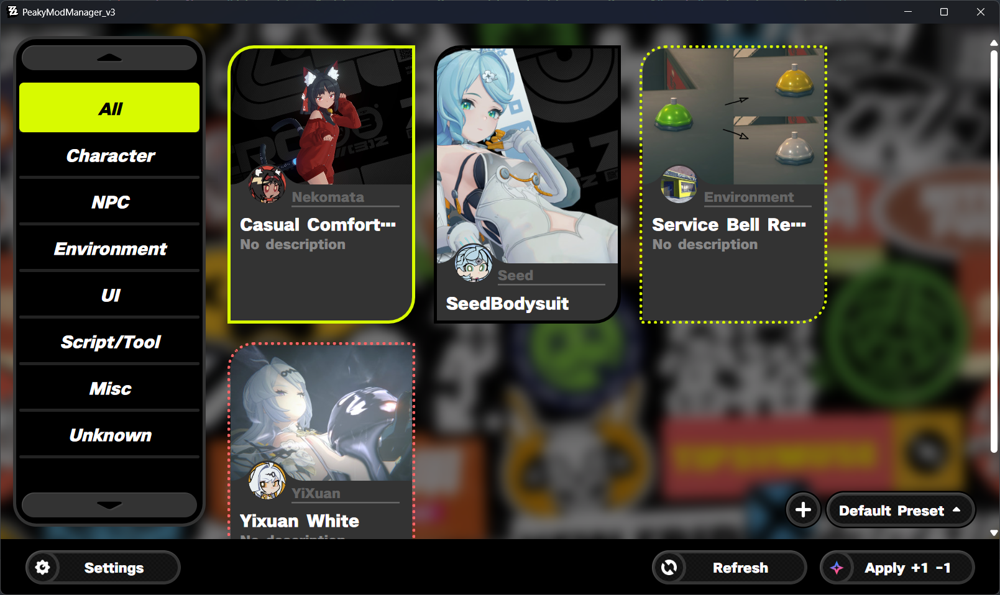
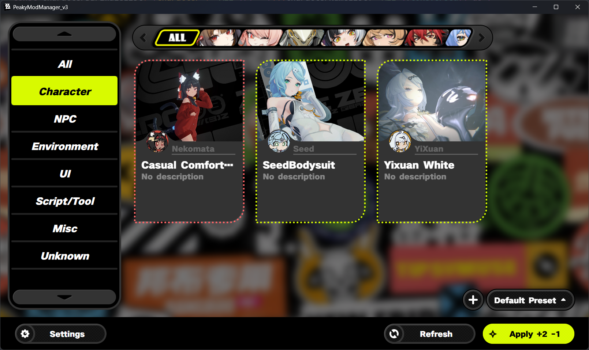
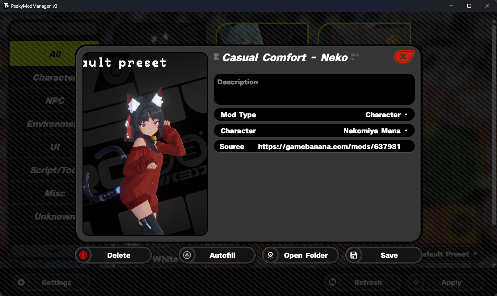
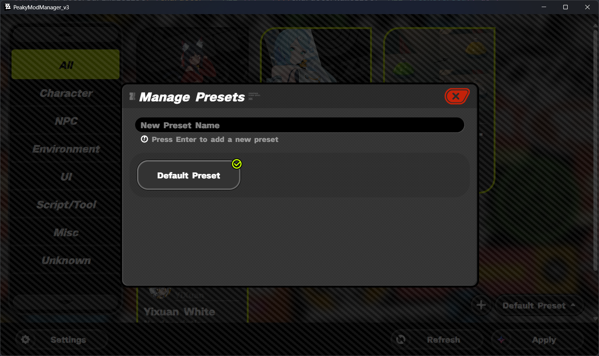
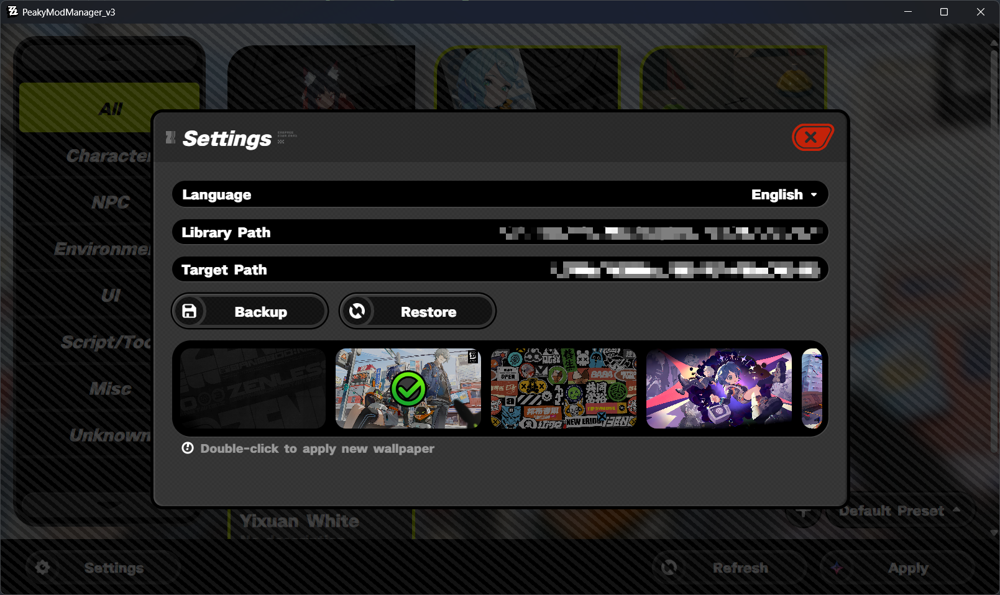

# PeakyModManager v3

A mod manager for **Zenless Zone Zero**.

## Features

- **Mod Management**: Easily import, enable, and disable mods.
- **Presets**: Save and switch between different mod configurations.
- **Visual Interface**: Clean, ZZZ-style UI design.
- **Backup & Restore**: Safely backup and restore your preset configurations.

## Getting Started

### 1. Initial Setup

Before using PeakyModManager, you need to configure the paths:

1. Click the **Settings** button in the bottom bar.
2. **Library Path**: Select the folder where you want to store your mods. This will serve as your main "source" folder.
3. **Target Path**: Select the game's mod folder where mods will be installed.
   - For **ZZMI users**, this should be `ZZMI/ZZMI/Mods`.

### 2. Importing Mods

- **Drag and Drop**: Drag a mod folder into the application window to import it into your Library.
- **Autofill**: Open a mod’s detailed view by right-clicking on its mod card, then click **Autofill**.
  - This automatically extracts and sets the mod’s description (from the readme file) and cover image.

### 3. Enabling & Disabling Mods

1. Click on a mod card to toggle its state:
   - **Yellow Border**: Mod is **enabled**.
   - **No Border**: Mod is **disabled**.
   - **Yellow Dashed Border**: Mod is queued to be **enabled**.
   - **Red Dashed Border**: Mod is queued to be **disabled**.
2. The **Apply** button in the bottom bar shows the number of pending changes.
3. Click **Apply** to commit changes. This will create or remove symlinks in your Target Path.

## Using Presets

Presets allow you to save and switch between different combinations of enabled mods.

### Switching Presets

1. Click the current preset name at the bottom right to open the list.
2. Select a preset to load it.
3. **Important**: Loading a preset only queues its mods in the "Pending" state. You must click **Apply** in the bottom bar to actually apply them.

### Managing Presets

1. Click the **+** button next to the preset name.
2. **Add**: Enter a name and click **Add** to create a new empty preset.
3. **Edit/Delete**: Use the edit or trash icons to rename or remove presets.

## Backup & Restore

Located in **Settings**:

- **Backup**: Saves your current presets configuration to a file named `Presets_Backup.json` inside your Library folder.
- **Restore**: Loads the `Presets_Backup.json` file.
  - _Note_: Restoring will overwrite your current preset list.
  - After restoring, you must re-apply the current preset from the pending queue to reflect changes.

## Previews

