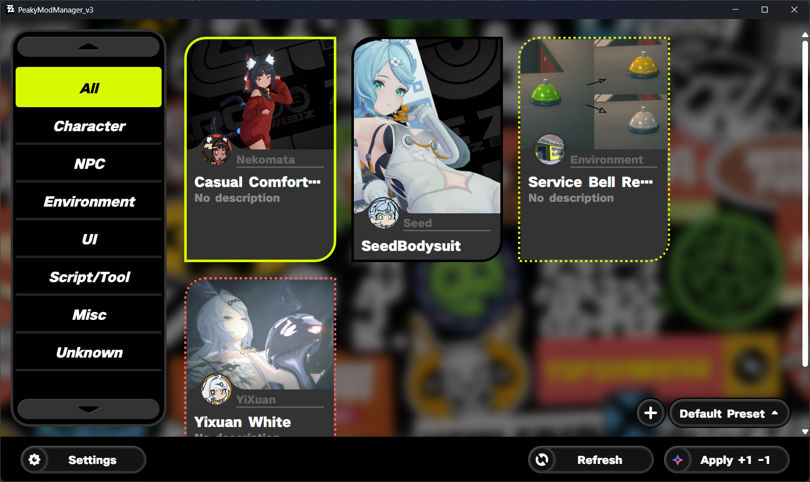
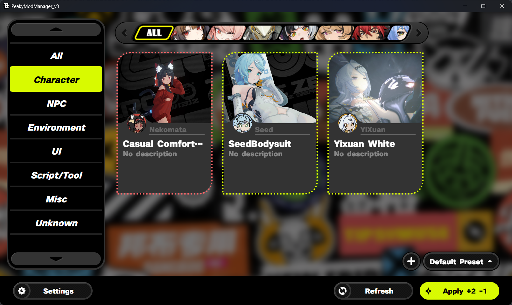
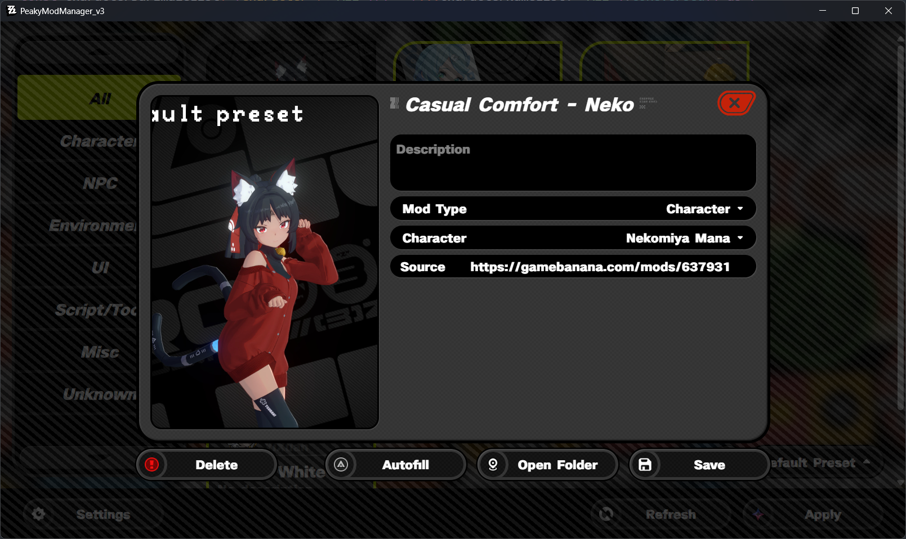
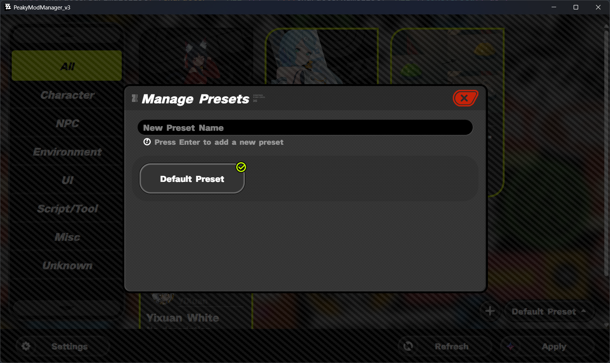
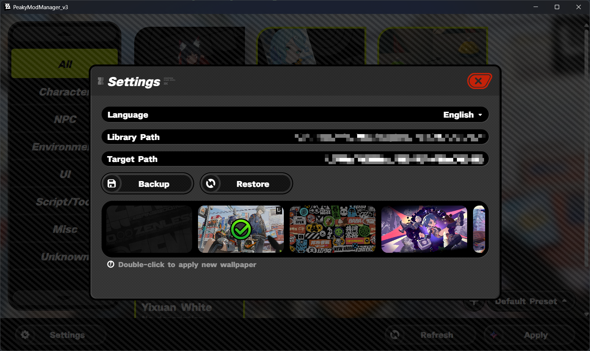

# PeakyModManager v3

[English](README.md) | [简体中文](README.zh-CN.md)

一款轻量级的绝区零 Mod 管理器。

## 功能

- **Mod 管理**
  轻松导入、启用和禁用 Mod。
- **预设**
  保存多套 Mod 配置，并在不同配置之间快速切换。
- **可视化界面**
  简洁的《**绝区零**》风格界面。
- **备份与恢复**
  备份和恢复预设配置。
- **Toggle 编辑**
  直接查看和编辑受支持的 Mod INI 文件中的持久化开关状态与按键绑定。
- **Windows 和 Linux 双平台支持**
  项目使用 Electron 开发，支持 Windows 和 Linux，但不保证在 Linux 平台上正常运行。

## 快速开始

### 初始设置

使用 PeakyModManager 前，需要配置以下路径：

1. 点击底部栏的**设置**按钮。
2. **模组库路径（Library Path）**
   选择用于存放 Mod 的文件夹，作为 Mod 的源目录。
3. **目标路径（Target Path）**
   选择游戏加载 Mod 的文件夹。
   - **ZZMI 用户**应选择 `ZZMI/ZZMI/Mods`。

4. **d3dx_user.ini 路径**（可选）
   如果需要使用**同步 Toggle（Sync Toggles）**，请选择 ZZMI 的 `d3dx_user.ini` 文件。
   编辑 Mod 自身的 Toggle 状态或按键绑定不需要配置此路径。

如果不确定如何设置，可以按以下步骤整理现有的 Mod 文件夹：

1. 将目前存放 Mod 的文件夹重命名为 `ModResources`，并确保其中只有子文件夹，没有散落的文件。
2. 在同一目录下新建一个空的 `Mods` 文件夹。
3. 将 `ModResources` 设置为**模组库路径（Library Path）**。
4. 将新建的 `Mods` 文件夹设置为**目标路径（Target Path）**。

---

### 导入 Mod

- **拖放导入**

  将 Mod 文件夹直接拖入应用窗口，即可导入模组库。
  新导入的 Mod 默认显示在**未知（Unknown）**分类中。

- **使用 [PMM-Mod-Importer](https://github.com/Tian-W001/PMM_Mod_Importer)**

  使用此 Chrome 扩展导入 GameBanana 上的 Mod，扩展会打开应用并开始下载 Mod。

- **手动导入须知**

  如果通过文件管理器直接向模组库添加 Mod 文件夹：
  - 点击**刷新**以识别新增的 Mod。
  - 这些 Mod 默认也会归入**未知（Unknown）**分类。

---

### 启用与禁用 Mod

1. 点击 Mod 卡片切换状态：
   - **黄色实线边框** → Mod **已启用**
   - **黑色实线边框** → Mod **已禁用**
   - **黄色虚线边框** → Mod **待启用**
   - **红色虚线边框** → Mod **待禁用**
2. 底部栏的**应用**按钮会显示待处理的变更数量。
3. 点击**应用**提交变更。
   此操作会在目标路径中创建或移除**符号链接**。

---

### 编辑 Mod

1. **右键点击** Mod 卡片，打开编辑窗口。
2. 可以编辑以下信息：
   - 描述
   - Mod 类型
   - 角色（仅角色类型的 Mod）
   - 服装（仅角色类型的 Mod）
   - 来源链接
   - 封面图（支持拖放图片或图片 URL）
3. 将鼠标悬停在角色或服装栏上，左侧会显示对应的头像或图标。点击后可跳转到对应的角色或服装视图。
4. **删除**
   会从磁盘中删除 **Mod 的实际文件**。
5. **自动填充**会执行以下操作：
   - 自动设置预览图：
     - 优先使用名为 `Preview` 的图片。
     - 若未找到，则使用其他可用图片。
   - 自动设置描述：
     - 如果存在名为 `readme` 的文件，则读取其内容。
   - 尝试根据 Mod 标题匹配角色名称：
     - 将 Mod 类型设为**角色（Character）**。
     - 设置为匹配到的角色。
6. 点击**保存**应用修改。

---

### 编辑 3DMigoto Toggle

当 Mod 包含 `global persist` 常量时，编辑窗口中会显示 **Toggles** 一栏：

- 左列显示持久化常量，例如 `$hair`。
- 点击当前按键绑定，再按下新的按键组合即可替换。按 `Esc` 可取消按键录入。
- 在右列编辑数值状态。状态和按键绑定的修改会立即保存到 Mod 的 INI 文件。
- 如果清空状态值，会恢复为之前保存的值；非数值内容不会写入文件。

这些编辑只会修改 Mod 内部的文件，不会修改 `d3dx_user.ini`。

**同步 Toggle（Sync Toggles）**是独立的单向操作：它读取已配置的 `d3dx_user.ini` 中记录的运行时持久化值，
并将匹配的值写回 Mod 的 INI 文件。如果某个常量不存在于 `d3dx_user.ini` 中，同步时不会修改该常量。

不保证同步 Toggle 功能在所有 Mod 中都能正常生效。

---

## 使用预设

1. 预设可以保存不同的 Mod 组合，方便随时切换。
2. 使用**右下角**的按钮切换当前预设。
3. ⚠️ **注意**
   加载预设只会将变更加入**待应用**列表。
   必须点击底部栏的**应用**按钮，变更才会实际生效。
4. 管理预设：
   - 点击 **+** 按钮打开预设管理。
   - 将鼠标悬停在预设卡片上，可显示**删除**按钮。

---

## 备份与恢复

在**设置**中使用：

- **备份**
  - 将预设配置保存到模组库文件夹中的 `Presets_Backup.json`。

- **恢复**
  - 从 `Presets_Backup.json` 加载数据。
  - ⚠️ 此操作会**覆盖**当前的预设配置。
  - 恢复后，需要将待应用列表中的变更**重新应用到当前预设**，才能使变更生效。

## 更新

- **自动更新**：启动应用后稍等片刻。当新版本下载完成时，系统会弹出通知，提示更新将在退出应用后安装。
- **手动更新**：前往 [Releases 页面](https://github.com/Tian-W001/PeakyModManager_v3/releases)下载安装包，然后运行并安装。

应用会随着游戏更新逐步补充角色资源。如果新角色的头像显示为未知头像，请耐心等待后续更新。

## 界面预览







## 已知问题

- **导入后的临时文件残留（已在 1.3.1 修复）**

  旧版本使用 [PMM-Mod-Importer](https://github.com/Tian-W001/PMM_Mod_Importer) 导入 Mod 时，可能会在以下目录中留下临时文件：

  ```text
  C:\Users\<用户名>\AppData\Roaming\peakymodmanager-v3\Mods
  ```

  如果使用过旧版本，可以检查此目录并删除残留的临时文件。
